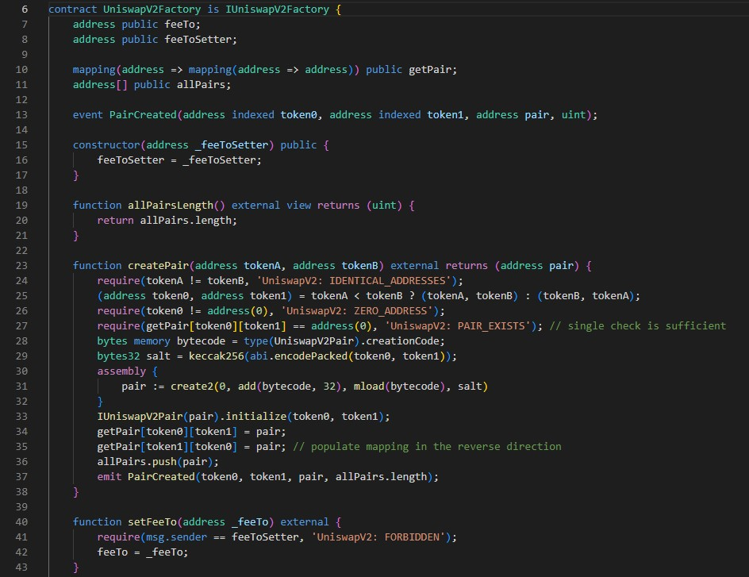

Factory contract 은 일반거래소(CEX, 중앙화거래소)의 상장 기능에 해당한다. 즉, Pair contract 을 생성한다. 이 때, EVM CREATE2 를 이용하여, 예측 가능한 주소에 Pair contact 을 배포한다.

code 를 보자.



line 6:
```
contract UniswapV2Factory is IUniswapV2Factory {
```
IUniswapV2Factory 인터페이스 구현을 선언

line 7 ~ 8:
```
address public feeTo;
address public feeToSetter;
```
fee 를 받을 주소와, fee 주소를 설정하는 주소(OpenZeppelin 의 Ownable 의 owner 와 유사)의 state variables 를 선언했다.

line 10 ~ 11:
```
mapping(address => mapping(address => address)) public getPair;
address[] public allPairs;
```
pair contract 의 주소를 저장하는 mapping 과, 배열로 access 할 수 있는 state variable 을 선언

line 13: 
흔히 보는 event 선언이다. pair contract 생성시 event 를 출력할 수 있게 정의.

핵심 함수인 createPair()를 보자.
line 23 ~ 25:
```
function createPair(address tokenA, address tokenB) external returns (address pair) {
  require(tokenA != tokenB, 'UniswapV2: IDENTICAL_ADDRESSES');
  (address token0, address token1) = tokenA < tokenB ? (tokenA, tokenB) : (tokenB, tokenA);
```
pair 로 지정할 token 의 주소를 비교하고(같은 것인지), sorting 해서, token0, token1 변수에 넣는다.
이미 존재하는 지 체크를 할때, mapping 에 sort 된 상태로 넣으면, 1번만 체크해 보면 되니까.

line 26: ~ 27:
```
require(token0 != address(0), 'UniswapV2: ZERO_ADDRESS');
require(getPair[token0][token1] == address(0), 'UniswapV2: PAIR_EXISTS'); // single check is sufficient
```
sort 한 뒤, token0 가 zero address 인지 체크하고, 이미 똑같은 pair 를 가진 contract 이 존재하는 지 체크한다. 위에서 말한대로, 주소를 기준으로 sort 해서, token0, token1 을 mapping 에 넣기 때문에, token1, token0 순서의 pair 는 검증하지 않아도 된다.


line 28 ~ 33:
```
bytes memory bytecode = type(UniswapV2Pair).creationCode;
bytes32 salt = keccak256(abi.encodePacked(token0, token1));
assembly {
    pair := create2(0, add(bytecode, 32), mload(bytecode), salt)
}
IUniswapV2Pair(pair).initialize(token0, token1);
```
EVM 의 CREATE2 opcode 로 contract 을 생성하고 초기화하는 코드이다. CREATE2 는 contract 주소를 사전에 계산할 수 있고, 같은 input 이면, 같은 값이 나오도록 되어 있다. 기존의 contract을 생성(배포)하는 CREATE 는 EOA 의 nonce 가 사용되면서, 극도로 주의(nonce 가 바뀌지 않도록)하지 않으면, contract 의 주소를 고정(fix) 하기가 어려웠다. 이런 Uniswap 같은 서비스는, 여러 pair 가 상장되어 사용되는 경우, 사전에 주소를 관리할 수 있으면, 보안(상장 전(contract deploy 전) reserve token 을 미리 보내둔다든지) 유지 등 편리한 경우가 있다.

line 34 ~ 37:
```
getPair[token0][token1] = pair;
getPair[token1][token0] = pair; // populate mapping in the reverse direction
allPairs.push(pair);
emit PairCreated(token0, token1, pair, allPairs.length);
```
여기 까지 내려오면, pair 변수에는, 새로 생성된 Pair contract 주소가 들어가 있게 되며, 초기화까지 마친 상태이다. 유지/관리를 위한 상태 변수들 update 하고, event emit 하면서 마치게 된다.

나머지 함수들은 함수 이름만으로 알 수 있는 직관적인 함수라서 별도 설명은 하지 않는다.
