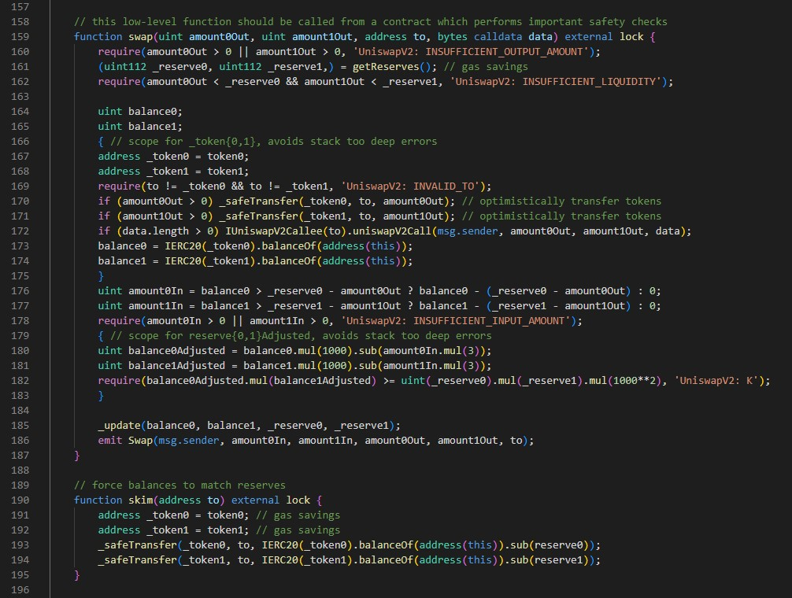
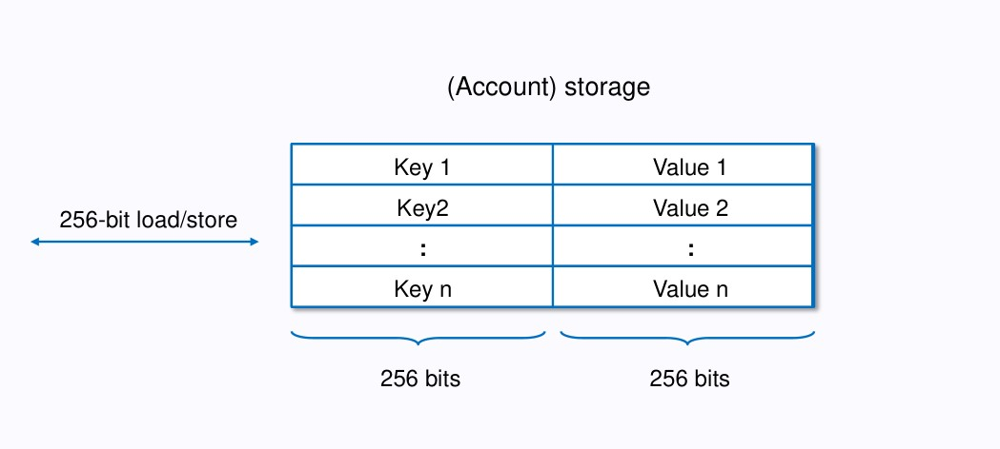
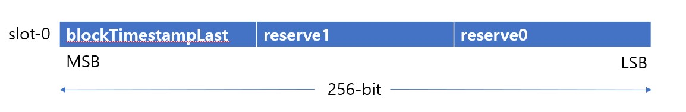

Pair contract 은 Uniswap v2 의 핵심 contract 이고, CFMM 의 logic 이 구현된 곳이다.

여러 준비 사항, field 변수등을 먼저 훑는 것 보단, 바로 핵심 함수로 가보자. LP 제공/제거등은 나중에 보도록 한다.

### 핵심 함수 swap()


함수 singature 부터 line 별로 보자.

line 159 :
```
function swap(uint amount0Out, uint amount1Out, address to, bytes calldata data) external lock
```

| param | type | 용도 |
| ------ | ------ | ------ |
| amount0Out | uint256 | token0 의 출력 개수 |
| amount1Out | uint256 | token1 의 출력 개수 |
| to | address | out 되는 token 받을 주소 |
| data | bytes | to 가 IUniswapV2Callee::uniswapV2Call 를 구현한 경우의 추가 parameter |

코드 전반에 걸쳐 postfix 로 0, 1 이 사용되는 데, token0, token1 의 '어떤 값'에 해당한다. 2개 token 을 0번째, 1번째로 구분한다.
이름에서 추정할 수 있는 것은, token0, token1 의 출력개수를 param 으로 받는다는 것이다. 

읭? swap 할 때, 몇개가 필요하다고 계산한 다음, call 해야하는 것이니, 어디선가 이 값을 계산할 것이다. 이게 uniswap v2-periphery 에 있는 router 가 담당하는 일들이다. 나중에 periphery contract 도 알아보자.

line 160 : 기본적인 조건 check.
```
require(amount0Out > 0 || amount1Out > 0, 'UniswapV2: INSUFFICIENT_OUTPUT_AMOUNT');
```

line 161 :
```
(uint112 _reserve0, uint112 _reserve1,) = getReserves(); // gas savings
```
uniswap logic 에는 중요하진 않지만, EVM gas 관점으로는 매우 눈여겨 보아야 하는 line 이다. ( "gas savings" 라고 comment 가 붙어있다. ) 

getReserves() 함수를 보자: 그냥 field 변수의 값을 named return value 로 리턴한다.
```
function getReserves() public view returns (uint112 _reserve0, uint112 _reserve1, uint32 _blockTimestampLast) {
    _reserve0 = reserve0;
    _reserve1 = reserve1;
    _blockTimestampLast = blockTimestampLast;
}
```
reserve0, reserve1 은 [CFMM](./../1-CFMM/README.md) 에서 설명하던 $x*y=k$ 식의 $x,y$이다.

핵심은, reserve0, reserve1, blockTimestampLast 가 선언된 방식에서 gas savings 를 달성하는 것이다. 그럼 선언된 모양을 보자.
```
uint112 private reserve0;           // uses single storage slot, accessible via getReserves
uint112 private reserve1;           // uses single storage slot, accessible via getReserves
uint32  private blockTimestampLast; // uses single storage slot, accessible via getReserves
```
그냥 uint256 으로 해도 될 거 같은데, 굳이 112-bit 2개, 32-bit 1 개의 변수로 나누어 놓았다. 112 *x* 2 + 32 = 256 그렇다. 256 bit 를 맞추어 놓은 것이다. 왜 256-bit 인가?

다음은, EVM 의 storage 영역의 구조이다.


EVM 의 멤버 변수가 저장되는 storage 는 256-bit 단위로 저장되며, 그 최소 단위인 256-bit 저장공간을 slot 이라 부른다. Smart Contract 의 멤버 변수(field variables) 는 모두 storage 에 저장되며, slot 0 부터 순서대로 저장된다.( 물론 그 크기만큼 공간을 차지한다.)

위의 unsiwap 소스의 comment 처럼, reserve0, reserve1, blockTimestampLast 3개 변수는, 1개 slot 에 3개의 변수가 딱 맞춰 들어가게 된다. 


Ethereum 의 storage 영역은 gas fee 가 비싸다. 따라서, 가능하면 적게 read/write 하여야 한다. 상대적으로 memory는 훨씬 싸다. 

그래서, 비용이 비싼 3개의 값을 1개의 slot 에 몰아넣고( 256 bit 로 packing), 한번에 읽어서 stack 에 저장해 두고, 사용하면(local 변수: ), 그 값이 필요할 때 마다 storage 를 읽는 것 보다( reserve0, reserve1, blockTimestampLast 읽기 ) 훨씬 적게 gas 비용이 들게 된다.

이제, line 164 ~ 169 을 보자.
```
uint balance0;
uint balance1;
{ // scope for _token{0,1}, avoids stack too deep errors
address _token0 = token0;
address _token1 = token1;
```

이 문장이 눈에 띈다: "avoids stack too deep errors"

다른 language 를 사용해 본 개발자들이 solidity 개발중 당황하게 되는 것이, 이 에러이다. solidity 는 함수 parameter 나 local 변수를 stack 에서 access 하는 yul assembly opcode 가 DUP1 ~ DUP16 까지의 16개 뿐이다. 그래서, 함수 parameter + local 변수 를 다른 언어처럼 생각하고, 좀(?) 만들게 되면 이러한 문제가 발생한다.

사실,  에러 메시지가 직관적이지 않아서 맘에 들진 않지만, 중간에 새로운 block 을 만들고( 새로운 stack frame 을 만들어서: '{' 와 '}' 로), 거기에서만 사용될 local 변수를 두면, 전체 local 변수 개수에 조금이나마 자유로울 수 있다.


line 170 ~ 171:
```
if (amount0Out > 0) _safeTransfer(_token0, to, amount0Out); // optimistically transfer tokens
if (amount1Out > 0) _safeTransfer(_token1, to, amount1Out); // optimistically transfer tokens
```
"그냥 swap 된 물량 전송하는 거네?" 라고 그냥 넘어가긴에 좀 이상하다.

[ swap 을 위한 입력 token 이 잘 들어온 건지 체크 하지 않고, 출력 token 을 보낸다! ]

## flash loan
이 일어나는 것이다. 사실 이건 line 172 의 코드가 실행되지 않으면, 별로 의미가 없다.
```
if (data.length > 0) IUniswapV2Callee(to).uniswapV2Call(msg.sender, amount0Out, amount1Out, data);
```
caller(to param 의 주소값) 가 contract 일 경우, callback 해 주는 것이다. 즉, swap 을 위해 [입력 token] 을 내지 않고, 먼저 원하는 만큼 [출력 token을] 받은 다음, callback 에서 뭔가를 할 수 있게 하는 것이다.

잠시 후의 code 에서, input 이 잘 들어왔는 지 체크한다.

이것의 의미는, 
" 먼저 output token 을 줄테니, 그걸 가지고, [ input token 을 벌어서, 전송하면 ] 문제 삼지 않겠다. "이다.

즉, 먼저 줄 테니(빌려줄테니), 그거 가지고, callback 받아서 input token 개수만큼 혹은 그 이상 [ 벌어서 전송해 두면 ], 모두가 행복(?)해 진다.

이것이 flash swap 이다. flash loan 과 swap 이 동시에 일어나며, 이건 uniswap 이 의도한 바이다. 자본이 없어도 차익거래(arbitrage) 를 할 수도 있고, 기회를 잘 포착하면, 이익을 꽤 올릴 수 있다.


line 173 ~ 174
```
balance0 = IERC20(_token0).balanceOf(address(this));
balance1 = IERC20(_token1).balanceOf(address(this));
```
callback 이 있을 경우, callback 후에, reserve0, reserve1 의 수량을 받는다. 최종적으로 올바른 swap 이 되게 하기 위한 준비이다.( flash loan 했으면, input token 을 잘 보내놨는지 보기 위해 잔고 측정하는 것이다)

line 176 ~ 178
```
uint amount0In = balance0 > _reserve0 - amount0Out ? balance0 - (_reserve0 - amount0Out) : 0;
uint amount1In = balance1 > _reserve1 - amount1Out ? balance1 - (_reserve1 - amount1Out) : 0;
require(amount0In > 0 || amount1In > 0, 'UniswapV2: INSUFFICIENT_INPUT_AMOUNT');
```
현재 잔고 - 출력 수량 = 입력한 수량
이므로, 입력이 잘 들어와 있는 지 보는 것이다. 정확한 수량이 아니라, 0 초과 인지만 본다.

line 179 ~ 183
```
{ // scope for reserve{0,1}Adjusted, avoids stack too deep errors
uint balance0Adjusted = balance0.mul(1000).sub(amount0In.mul(3));
uint balance1Adjusted = balance1.mul(1000).sub(amount1In.mul(3));
require(balance0Adjusted.mul(balance1Adjusted) >= uint(_reserve0).mul(_reserve1).mul(1000**2), 'UniswapV2: K');
}
```
0.3% 의 수수료를 뗀다음, 남은 수량을 계산하는 것이며, 그 후, require 로, K 값의 변화(감소)가 있었던 것인지 확인한다.([CFMM](./../1-CFMM/README.md) 에서 설명하던 $x*y=k$ 에서, swap 에서는 $k$ 가 변화가 생기면 안된다고 했다.) 

정확한 input 수량만큼 현재 contract 으로 들어온 건지 여기서 확인하는 셈이다. ( 돈(token) 떼먹을 수 있다고 기대에 부풀지 말자 =.= )
